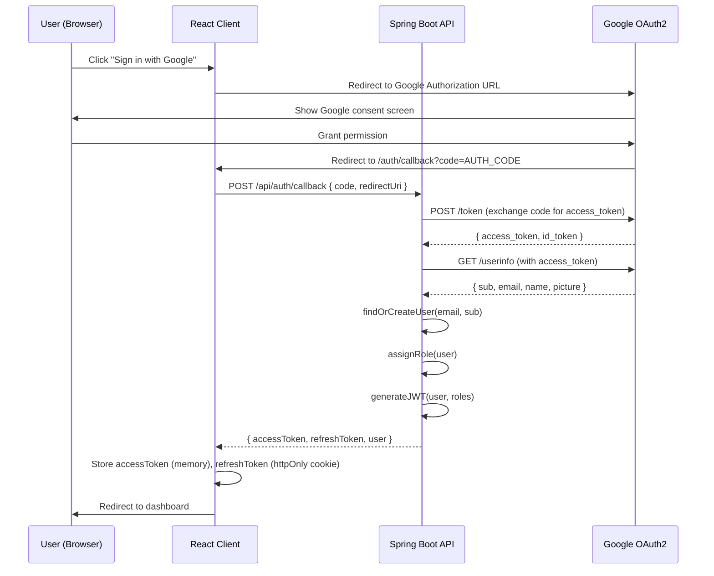
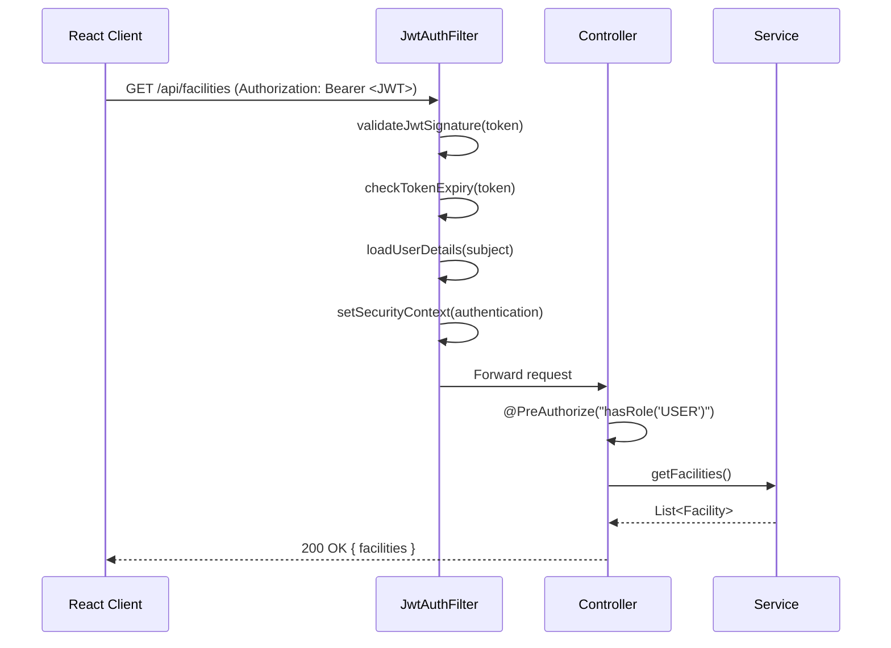
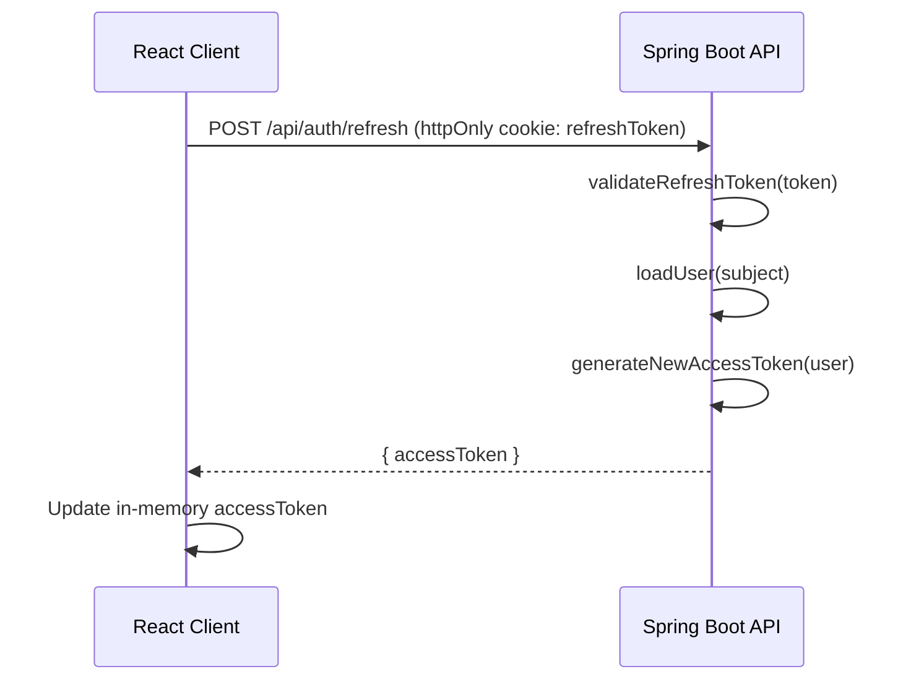

# Design Document: OAuth2 Authentication & Authorization (Module E)

## Overview

Module E provides OAuth 2.0-based authentication and role-based access control (RBAC) for the SLIIT Smart Campus Operations Hub. Users authenticate via an external OAuth 2.0 provider (Google), receive a JWT issued by the Spring Boot backend, and the React client uses that token to access protected API endpoints and guarded front-end routes.

The module integrates with all other modules (A–D) as the security foundation: every API call from the React client must carry a valid JWT, and every protected endpoint enforces role checks. Supported roles are `USER`, `ADMIN`, `TECHNICIAN`, and `MANAGER`.

---

## Architecture

```mermaid
graph TD
    subgraph React Client
        A[Login Page] -->|Redirect to Google| B[OAuth2 Redirect Handler]
        B -->|POST /auth/callback| C[Auth Service - Frontend]
        C -->|Store JWT in memory / httpOnly cookie| D[Route Guard / PrivateRoute]
        D --> E[Protected Pages - Modules A-D]
    end

    subgraph Spring Boot Backend
        F[/auth/callback - AuthController] -->|Exchange code| G[OAuth2 Token Exchange]
        G -->|Fetch user info| H[Google UserInfo API]
        H --> I[UserService - findOrCreate]
        I --> J[JwtService - generateToken]
        J -->|Return JWT + refresh token| F
        K[Spring Security Filter Chain] -->|Validate JWT| L[JwtAuthFilter]
        L --> M[Role-Based Endpoint Guards]
    end

    subgraph External
        N[Google OAuth2 Provider]
    end

    B -->|Authorization Code| F
    G <-->|HTTPS| N
    E -->|API calls with Bearer JWT| K
```

---

## Sequence Diagrams

### Login Flow (OAuth2 Authorization Code)



### Authenticated API Request Flow



### Token Refresh Flow



---

## Components and Interfaces

### Backend Components

#### AuthController

**Purpose**: Handles OAuth2 callback, token refresh, and logout endpoints.

**Interface**:
```java
@RestController
@RequestMapping("/api/auth")
public interface AuthController {

    @PostMapping("/callback")
    ResponseEntity<AuthResponse> handleOAuthCallback(@RequestBody OAuthCallbackRequest request);

    @PostMapping("/refresh")
    ResponseEntity<TokenResponse> refreshToken(HttpServletRequest request);

    @PostMapping("/logout")
    ResponseEntity<Void> logout(HttpServletResponse response);

    @GetMapping("/me")
    ResponseEntity<UserResponse> getCurrentUser(Authentication authentication);
}
```

**Responsibilities**:
- Exchange OAuth2 authorization code for tokens via Google
- Issue application-level JWT and refresh token
- Validate and rotate refresh tokens
- Return current authenticated user info

---

#### JwtService

**Purpose**: Generates, validates, and parses JWTs.

**Interface**:
```java
public interface JwtService {
    String generateAccessToken(AppUser user);
    String generateRefreshToken(AppUser user);
    boolean validateToken(String token);
    String extractSubject(String token);
    List<String> extractRoles(String token);
    Date extractExpiry(String token);
}
```

**Responsibilities**:
- Sign JWTs with HS256 using a secret key (configurable via env)
- Embed `sub` (userId), `roles`, `iat`, `exp` claims
- Validate signature and expiry
- Access tokens expire in 15 minutes; refresh tokens in 7 days

---

#### UserService

**Purpose**: Manages user persistence and role assignment.

**Interface**:
```java
public interface UserService {
    AppUser findOrCreateUser(OAuth2UserInfo userInfo);
    AppUser findById(UUID userId);
    AppUser updateRole(UUID userId, Role role);
    List<AppUser> findAllByRole(Role role);
}
```

**Responsibilities**:
- Create user on first OAuth2 login (provisioning)
- Assign default role `USER` to new users
- Allow `ADMIN` to promote users to other roles
- Persist Google `sub` as external identity reference

---

#### JwtAuthFilter

**Purpose**: Spring Security filter that validates JWT on every request.

**Interface**:
```java
public class JwtAuthFilter extends OncePerRequestFilter {
    @Override
    protected void doFilterInternal(
        HttpServletRequest request,
        HttpServletResponse response,
        FilterChain filterChain
    ) throws ServletException, IOException;
}
```

**Responsibilities**:
- Extract `Bearer` token from `Authorization` header
- Validate token via `JwtService`
- Populate `SecurityContextHolder` with `UsernamePasswordAuthenticationToken`
- Pass 401 on invalid/missing token for protected routes

---

#### SecurityConfig

**Purpose**: Configures Spring Security filter chain, CORS, CSRF, and endpoint authorization rules.

**Responsibilities**:
- Disable session creation (stateless JWT)
- Configure CORS for React client origin
- Disable CSRF (JWT-based, not cookie-session)
- Define public routes: `/api/auth/**`, `/actuator/health`
- Require authentication for all other routes
- Register `JwtAuthFilter` before `UsernamePasswordAuthenticationFilter`

---

### Frontend Components

#### AuthContext (React Context)

**Purpose**: Provides authentication state and actions to the entire React app.

**Interface**:
```typescript
interface AuthContextValue {
  user: AuthUser | null;
  accessToken: string | null;
  isAuthenticated: boolean;
  isLoading: boolean;
  login: () => void;           // Redirect to Google OAuth
  logout: () => Promise<void>;
  refreshToken: () => Promise<boolean>;
}
```

---

#### PrivateRoute

**Purpose**: HOC/wrapper that guards routes requiring authentication and specific roles.

**Interface**:
```typescript
interface PrivateRouteProps {
  children: React.ReactNode;
  requiredRoles?: Role[];      // If omitted, any authenticated user passes
}

function PrivateRoute({ children, requiredRoles }: PrivateRouteProps): JSX.Element;
```

**Responsibilities**:
- Redirect unauthenticated users to `/login`
- Redirect authenticated users without required role to `/unauthorized`
- Render children when access is granted

---

#### apiClient (Axios Instance)

**Purpose**: Centralized HTTP client with JWT injection and token refresh interceptor.

**Interface**:
```typescript
const apiClient: AxiosInstance;

// Request interceptor: attach Authorization header
// Response interceptor: on 401, attempt token refresh then retry
```

---

## Data Models

### AppUser

```java
@Entity
@Table(name = "users")
public class AppUser {
    @Id
    private UUID id;

    @Column(unique = true, nullable = false)
    private String email;

    private String name;
    private String pictureUrl;

    @Column(unique = true, nullable = false)
    private String googleSub;       // Google's stable user identifier

    @Enumerated(EnumType.STRING)
    private Role role;              // USER | ADMIN | TECHNICIAN | MANAGER

    private boolean active;

    private Instant createdAt;
    private Instant updatedAt;
}
```

**Validation Rules**:
- `email` must be a valid email format and unique
- `googleSub` must be non-null and unique (prevents duplicate accounts)
- `role` defaults to `USER` on creation
- `active` defaults to `true`; inactive users are denied access

---

### Role (Enum)

```java
public enum Role {
    USER,
    ADMIN,
    TECHNICIAN,
    MANAGER
}
```

**Access Matrix**:

| Role        | Read Resources | Book Facilities | Manage Tickets | Admin Panel |
|-------------|:--------------:|:---------------:|:--------------:|:-----------:|
| USER        | ✅             | ✅              | ❌             | ❌          |
| TECHNICIAN  | ✅             | ✅              | ✅             | ❌          |
| MANAGER     | ✅             | ✅              | ✅             | ❌          |
| ADMIN       | ✅             | ✅              | ✅             | ✅          |

---

### RefreshToken

```java
@Entity
@Table(name = "refresh_tokens")
public class RefreshToken {
    @Id
    private UUID id;

    @ManyToOne
    private AppUser user;

    @Column(unique = true, nullable = false)
    private String tokenHash;       // SHA-256 hash of the raw token

    private Instant expiresAt;
    private boolean revoked;
    private Instant createdAt;
}
```

**Validation Rules**:
- `tokenHash` stored as SHA-256 hash, never the raw token
- `expiresAt` must be in the future on creation
- Revoked tokens are rejected immediately
- Old refresh tokens are revoked on rotation (one-time use)

---

### AuthResponse (API DTO)

```java
public record AuthResponse(
    String accessToken,
    String tokenType,       // "Bearer"
    long expiresIn,         // seconds
    UserResponse user
) {}

public record UserResponse(
    UUID id,
    String email,
    String name,
    String pictureUrl,
    String role
) {}
```

---

### AuthUser (Frontend Type)

```typescript
interface AuthUser {
  id: string;
  email: string;
  name: string;
  pictureUrl: string;
  role: 'USER' | 'ADMIN' | 'TECHNICIAN' | 'MANAGER';
}
```

---

## Algorithmic Pseudocode

### OAuth2 Callback Handler

```pascal
PROCEDURE handleOAuthCallback(request: OAuthCallbackRequest)
  INPUT: request.code (authorization code), request.redirectUri
  OUTPUT: AuthResponse

  PRECONDITION: request.code IS NOT NULL AND NOT EMPTY
  PRECONDITION: request.redirectUri MATCHES configured allowed URIs

  SEQUENCE
    // Step 1: Exchange code for Google tokens
    googleTokens ← googleOAuthClient.exchangeCode(
      code: request.code,
      redirectUri: request.redirectUri,
      clientId: GOOGLE_CLIENT_ID,
      clientSecret: GOOGLE_CLIENT_SECRET
    )

    IF googleTokens IS NULL OR googleTokens.accessToken IS NULL THEN
      THROW OAuthException("Failed to exchange authorization code")
    END IF

    // Step 2: Fetch user info from Google
    userInfo ← googleOAuthClient.getUserInfo(googleTokens.accessToken)

    IF userInfo.email IS NULL THEN
      THROW OAuthException("Email not provided by OAuth provider")
    END IF

    // Step 3: Find or create user in database
    user ← userService.findOrCreateUser(userInfo)

    IF NOT user.active THEN
      THROW AccessDeniedException("Account is deactivated")
    END IF

    // Step 4: Generate application tokens
    accessToken ← jwtService.generateAccessToken(user)
    refreshToken ← jwtService.generateRefreshToken(user)

    // Step 5: Persist refresh token (hashed)
    refreshTokenService.save(user, SHA256(refreshToken), expiresAt: NOW + 7 days)

    RETURN AuthResponse(
      accessToken: accessToken,
      tokenType: "Bearer",
      expiresIn: 900,
      user: toUserResponse(user)
    )
  END SEQUENCE

  POSTCONDITION: returned accessToken is a valid signed JWT
  POSTCONDITION: refresh token is persisted in hashed form
END PROCEDURE
```

---

### JWT Generation

```pascal
PROCEDURE generateAccessToken(user: AppUser)
  INPUT: user (AppUser entity)
  OUTPUT: signedJwt (String)

  PRECONDITION: user.id IS NOT NULL
  PRECONDITION: user.role IS NOT NULL
  PRECONDITION: JWT_SECRET length >= 32 characters

  SEQUENCE
    now ← currentTimestamp()
    expiry ← now + 900 seconds  // 15 minutes

    claims ← {
      sub: user.id.toString(),
      email: user.email,
      roles: [ "ROLE_" + user.role.name() ],
      iat: now,
      exp: expiry
    }

    signedJwt ← HMAC_SHA256_sign(claims, JWT_SECRET)

    RETURN signedJwt
  END SEQUENCE

  POSTCONDITION: returned string is a valid 3-part JWT (header.payload.signature)
  POSTCONDITION: token expires exactly 900 seconds from issuance
END PROCEDURE
```

---

### JWT Validation

```pascal
PROCEDURE validateToken(token: String)
  INPUT: token (raw JWT string)
  OUTPUT: isValid (Boolean)

  SEQUENCE
    IF token IS NULL OR token IS EMPTY THEN
      RETURN false
    END IF

    TRY
      claims ← HMAC_SHA256_verify(token, JWT_SECRET)

      IF claims.exp < currentTimestamp() THEN
        RETURN false
      END IF

      IF claims.sub IS NULL OR claims.sub IS EMPTY THEN
        RETURN false
      END IF

      RETURN true

    CATCH SignatureException
      RETURN false
    CATCH MalformedJwtException
      RETURN false
    END TRY
  END SEQUENCE

  POSTCONDITION: returns true ONLY IF signature is valid AND token is not expired
END PROCEDURE
```

---

### Token Refresh

```pascal
PROCEDURE refreshAccessToken(rawRefreshToken: String)
  INPUT: rawRefreshToken from httpOnly cookie
  OUTPUT: new accessToken (String)

  PRECONDITION: rawRefreshToken IS NOT NULL

  SEQUENCE
    tokenHash ← SHA256(rawRefreshToken)
    storedToken ← refreshTokenRepository.findByTokenHash(tokenHash)

    IF storedToken IS NULL THEN
      THROW UnauthorizedException("Refresh token not found")
    END IF

    IF storedToken.revoked THEN
      // Possible token theft — revoke all tokens for this user
      refreshTokenRepository.revokeAllForUser(storedToken.user)
      THROW UnauthorizedException("Refresh token reuse detected")
    END IF

    IF storedToken.expiresAt < NOW THEN
      THROW UnauthorizedException("Refresh token expired")
    END IF

    // Rotate: revoke old, issue new
    storedToken.revoked ← true
    refreshTokenRepository.save(storedToken)

    user ← storedToken.user
    newAccessToken ← jwtService.generateAccessToken(user)
    newRefreshToken ← jwtService.generateRefreshToken(user)
    refreshTokenService.save(user, SHA256(newRefreshToken), expiresAt: NOW + 7 days)

    RETURN { accessToken: newAccessToken, refreshToken: newRefreshToken }
  END SEQUENCE

  POSTCONDITION: old refresh token is revoked
  POSTCONDITION: new refresh token is persisted
  POSTCONDITION: returned accessToken is valid for 15 minutes
END PROCEDURE
```

---

### findOrCreateUser

```pascal
PROCEDURE findOrCreateUser(userInfo: OAuth2UserInfo)
  INPUT: userInfo { sub, email, name, picture }
  OUTPUT: AppUser

  PRECONDITION: userInfo.email IS NOT NULL
  PRECONDITION: userInfo.sub IS NOT NULL

  SEQUENCE
    existingUser ← userRepository.findByGoogleSub(userInfo.sub)

    IF existingUser IS NOT NULL THEN
      // Update mutable fields in case they changed on Google
      existingUser.name ← userInfo.name
      existingUser.pictureUrl ← userInfo.picture
      RETURN userRepository.save(existingUser)
    END IF

    // First-time login — provision new user
    newUser ← AppUser {
      id: UUID.randomUUID(),
      email: userInfo.email,
      name: userInfo.name,
      pictureUrl: userInfo.picture,
      googleSub: userInfo.sub,
      role: Role.USER,
      active: true,
      createdAt: NOW
    }

    RETURN userRepository.save(newUser)
  END SEQUENCE

  POSTCONDITION: returned user exists in database
  POSTCONDITION: new users always receive Role.USER
END PROCEDURE
```

---

### React PrivateRoute Guard

```typescript
function PrivateRoute({ children, requiredRoles }: PrivateRouteProps): JSX.Element {
  const { isAuthenticated, isLoading, user } = useAuth();

  // PRECONDITION: AuthContext is available in component tree

  if (isLoading) {
    return <LoadingSpinner />;
  }

  if (!isAuthenticated || user === null) {
    // Redirect to login, preserving intended destination
    return <Navigate to="/login" state={{ from: location }} replace />;
  }

  if (requiredRoles && requiredRoles.length > 0) {
    const hasRequiredRole = requiredRoles.includes(user.role);
    if (!hasRequiredRole) {
      return <Navigate to="/unauthorized" replace />;
    }
  }

  return <>{children}</>;
}

// POSTCONDITION: children render only when user is authenticated
// POSTCONDITION: users without required role are redirected to /unauthorized
```

---

### Axios Interceptor (Token Refresh on 401)

```typescript
// Request interceptor — attach access token
apiClient.interceptors.request.use((config) => {
  const token = authStore.getAccessToken();  // in-memory only
  if (token) {
    config.headers.Authorization = `Bearer ${token}`;
  }
  return config;
});

// Response interceptor — handle 401 with refresh
let isRefreshing = false;
let failedQueue: QueuedRequest[] = [];

apiClient.interceptors.response.use(
  (response) => response,
  async (error: AxiosError) => {
    const originalRequest = error.config as RetryableRequest;

    if (error.response?.status === 401 && !originalRequest._retry) {
      if (isRefreshing) {
        // Queue request until refresh completes
        return new Promise((resolve, reject) => {
          failedQueue.push({ resolve, reject });
        }).then((token) => {
          originalRequest.headers.Authorization = `Bearer ${token}`;
          return apiClient(originalRequest);
        });
      }

      originalRequest._retry = true;
      isRefreshing = true;

      try {
        const { accessToken } = await authService.refreshToken();
        authStore.setAccessToken(accessToken);
        processQueue(null, accessToken);
        originalRequest.headers.Authorization = `Bearer ${accessToken}`;
        return apiClient(originalRequest);
      } catch (refreshError) {
        processQueue(refreshError, null);
        authStore.clearTokens();
        window.location.href = '/login';
        return Promise.reject(refreshError);
      } finally {
        isRefreshing = false;
      }
    }

    return Promise.reject(error);
  }
);
```

---

## Key Functions with Formal Specifications

### JwtAuthFilter.doFilterInternal()

```java
protected void doFilterInternal(
    HttpServletRequest request,
    HttpServletResponse response,
    FilterChain filterChain
) throws ServletException, IOException
```

**Preconditions**:
- `request` is a valid HTTP request
- `JwtService` bean is available and initialized with a valid secret

**Postconditions**:
- If token is valid: `SecurityContextHolder` contains authenticated `UsernamePasswordAuthenticationToken`
- If token is missing/invalid: `SecurityContextHolder` remains empty; filter chain continues (Spring Security will reject at authorization layer)
- Filter chain is always invoked (never short-circuits silently)

**Loop Invariants**: N/A (no loops)

---

### UserService.findOrCreateUser()

**Preconditions**:
- `userInfo.email` is non-null and valid email format
- `userInfo.sub` is non-null and non-empty
- Database connection is available

**Postconditions**:
- Exactly one `AppUser` record exists for the given `googleSub`
- Returned user has `active = true` (creation path)
- Returned user has `role = USER` (creation path only)

---

### RefreshTokenService.save()

**Preconditions**:
- `user` is a persisted `AppUser`
- `tokenHash` is a 64-character hex string (SHA-256 output)
- `expiresAt` is in the future

**Postconditions**:
- Exactly one non-revoked refresh token exists per user (old tokens revoked on rotation)
- Raw token is never stored; only the hash

---

## Error Handling

### Scenario 1: Invalid/Expired JWT

**Condition**: `Authorization` header contains a JWT with invalid signature or past `exp`
**Response**: `401 Unauthorized` with body `{ "error": "invalid_token", "message": "Token is expired or invalid" }`
**Recovery**: React client intercepts 401, attempts refresh; if refresh fails, redirects to `/login`

---

### Scenario 2: Insufficient Role

**Condition**: Authenticated user accesses an endpoint requiring a role they don't have
**Response**: `403 Forbidden` with body `{ "error": "access_denied", "message": "Insufficient permissions" }`
**Recovery**: React client shows `/unauthorized` page; no automatic retry

---

### Scenario 3: OAuth2 Code Exchange Failure

**Condition**: Google returns an error during code exchange (expired code, wrong redirect URI)
**Response**: `400 Bad Request` with body `{ "error": "oauth_error", "message": "Failed to authenticate with provider" }`
**Recovery**: React client shows error on login page with retry option

---

### Scenario 4: Refresh Token Reuse (Possible Theft)

**Condition**: A refresh token that has already been rotated is presented again
**Response**: `401 Unauthorized`; all refresh tokens for that user are immediately revoked
**Recovery**: User must re-authenticate via OAuth2 login

---

### Scenario 5: Deactivated Account

**Condition**: User exists in DB but `active = false`
**Response**: `403 Forbidden` with body `{ "error": "account_disabled" }`
**Recovery**: User must contact admin; no self-service recovery

---

## Testing Strategy

### Unit Testing Approach

- `JwtService`: Test token generation, validation, expiry, and claim extraction with valid/invalid/expired tokens
- `UserService.findOrCreateUser()`: Test new user creation, existing user update, duplicate `googleSub` handling
- `JwtAuthFilter`: Test filter with valid token, missing header, malformed token, expired token
- `PrivateRoute` (React): Test redirect behavior for unauthenticated users, role-insufficient users, and authorized users

### Property-Based Testing Approach

**Property Test Library**: `fast-check` (React/TypeScript), `junit-quickcheck` (Spring Boot)

Key properties to verify:
- For any valid `AppUser`, `validateToken(generateAccessToken(user))` always returns `true`
- For any token `t`, if `validateToken(t) = true` then `extractSubject(t)` returns a non-null UUID
- For any expired token (exp < now), `validateToken(t)` always returns `false`
- `findOrCreateUser` is idempotent: calling it twice with the same `googleSub` returns the same user record

### Integration Testing Approach

- Full OAuth2 callback flow using WireMock to stub Google endpoints
- End-to-end role enforcement: create users with each role, verify correct 200/403 responses per endpoint
- Refresh token rotation: verify old token is rejected after rotation
- React route guard: Cypress/Playwright tests for protected route redirects

---

## Performance Considerations

- JWT validation is stateless and CPU-bound (HMAC-SHA256) — no DB call per request; keeps latency low
- Refresh token lookup uses an indexed `tokenHash` column — O(log n) lookup
- `findOrCreateUser` uses `googleSub` as a unique indexed column — single-row lookup
- Access token TTL of 15 minutes limits the window of token misuse without requiring token revocation infrastructure

---

## Security Considerations

- **Access tokens stored in memory only** (React) — not in `localStorage` or `sessionStorage` to prevent XSS theft
- **Refresh tokens in `httpOnly`, `Secure`, `SameSite=Strict` cookies** — inaccessible to JavaScript
- **CSRF protection**: `SameSite=Strict` on refresh token cookie mitigates CSRF; CSRF tokens not needed for JWT-based API
- **Refresh token rotation with reuse detection**: stolen refresh tokens are detected and all sessions invalidated
- **CORS**: Spring Boot configured to allow only the React client origin (`ALLOWED_ORIGIN` env var)
- **Secret management**: `JWT_SECRET` and `GOOGLE_CLIENT_SECRET` loaded from environment variables, never hardcoded
- **HTTPS enforced**: All OAuth2 redirects and API calls must use HTTPS in production
- **`googleSub` as identity anchor**: Email alone is not used as identity (emails can change); Google's stable `sub` claim is the primary key for identity matching

---

## Dependencies

### Backend (Spring Boot)

| Dependency | Purpose |
|---|---|
| `spring-boot-starter-security` | Security filter chain, method security |
| `spring-boot-starter-oauth2-client` | OAuth2 client support (optional — can use manual exchange) |
| `io.jsonwebtoken:jjwt-api` + `jjwt-impl` + `jjwt-jackson` | JWT generation and validation |
| `spring-boot-starter-data-jpa` | User and refresh token persistence |
| `spring-boot-starter-web` | REST controllers |
| `org.postgresql:postgresql` | Production database driver |

### Frontend (React)

| Dependency | Purpose |
|---|---|
| `axios` | HTTP client with interceptor support |
| `react-router-dom` | Client-side routing and `Navigate` |
| `@tanstack/react-query` | Server state management for auth-aware queries |
| `fast-check` (dev) | Property-based testing |

### External Services

| Service | Purpose |
|---|---|
| Google OAuth2 (`accounts.google.com`) | Authorization server and user identity provider |
